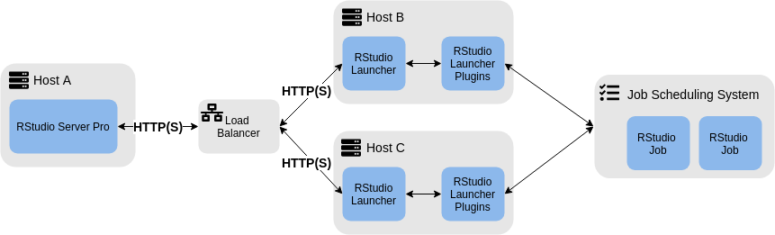
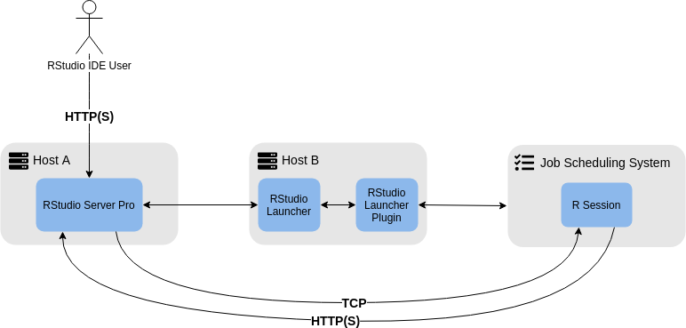

# The RStudio Launcher {#launcher}

The purpose of the RStudio Launcher is to provide a generic interface to integrate job scheduling systems with RStudio Server Pro and other RStudio products. The Launcher itself is not specific to R processes, and should be able to launch arbitrary work through any job scheduling system for which a Plugin  exists. This section will describe the way that RStudio products may integrate with the Launcher, the way the Launcher communicates with and manages Plugins, and network architecture requirements.

## Public Interface {#launcher-pub}

On the front-end, the Launcher exposes an HTTP API. RStudio products which wish to integrate with the Launcher send HTTP requests, such as `GET /jobs` or `POST /jobs` to the Launcher. The Launcher handles authentication and authorization for each of these requests, distills the necessary information for a Plugin, and forwards those details to the appropriate Plugin. As a result, there is no requirement for the Launcher to be running on the same machine as the RStudio product which will make use of it. For more information about network architecture requirements, see section \@ref(net-arch).

## Plugin Management {#plugin-mgmt}

When the Launcher is started, it reads `/etc/rstudio/launcher.conf` which contains a (SECTION NAME) section for each Plugin which should be used. The Launcher will start a child process for each Plugin and request that the Plugin initialize itself with a `Bootstrap` request. During this request, the Plugin is responsible for ensuring that it has an accurate list of the jobs currently in its respective job scheduling system. If any configured Plugin fails to bootstrap correctly, the Launcher will fail to start. 

During the lifetime of the Launcher, it will forward requests to the Plugins as appropriate, via the JSON Launcher Plugin API. In the current version, the Launcher is only able to communicate with Plugins over standard input and output. As a result, the Launcher and each Plugin must be run on the same machine.

When the Launcher is terminated, it will send a termination signal to each of the Plugins it is managing.

Receiving requests, formatting and sending responses, and listening for signals are all handled by the SDK before the Plugin specific implementations are invoked. Thus, the Plugin developer can focus solely on the parts of the implementation that will integrate the Plugin with the job scheduling system.

## Network Architecture Requirements {#net-arch}

As mentioned in section \@ref(launcher-pub), it is not necessary for the Launcher and the RStudio product which will make use of it to be running on the same machine. The RStudio product which will use the Launcher needs to be able to communicate with the launcher over HTTP or HTTPS on the configured port. The default Launcher port is `5559`, but it can be modified in `launcher.rstudio.conf`. In figure \@ref(fig:simple-net), a very simple network architecture is shown in which RStudio Server Pro is running on Host A and the Launcher and its Plugins are running on Host B. The Plugins must also be able to reach and communicate with their respective job scheduling systems (or compute clusters).

```{r simple-net, echo=FALSE, eval=TRUE, fig.cap="Simple Launcher Network Architecture"}

```

It is possible to load balance multiple instances of the Launcher for improved request throughput. An example with two Launcher instances is depicted in \@ref(fig:load-balanced-net), below.

```{r load-balanced-net, echo=FALSE, eval=TRUE, fig.cap="Load Balanced Launcher Network Architecture"}

```

In order to work correctly with a load balanced architecture, the Plugin implementation must be able to return the same output from any Plugin which is part of the Launcher cluster. As each API call is described in detail in the following sections, requirements for an implementation of that API call which supports load balancing will be discussed.

### RStudio Server Pro Integration

When integrating the Launcher with RStudio Server Pro, there are two additional cases which must be considered when configuring the network: using Launcher Sessions, and using Launcher Jobs. Regardless of whether the Launcher is load balanced the network requirements stay the same, so the diagrams in this section will be based on the architecture describned in figure \@ref(fig:simple-net), but may be applied to the architecture described in figure \@ref(fig:load-balanced-net).

When using Launcher Sessions, the RStudio Server Pro process must be able to communicate with the R, Jupyter, or other session over TCP on an arbitrary port.

```{r session-net, echo=FALSE, eval=TRUE, fig.cap="Launcher Sessions"}

```

When using Launcher Jobs without Launcher Sessions, there are no special network considerations. However, when using Launcher Jobs with Launcher Sessions the R sessions must be able to communicate with RStudio Server Pro over HTTP(S), in the same way as an RStudio IDE user would.

```{r session-job-net, echo=FALSE, eval=TRUE, fig.cap="Launcher Jobs with Launcher Sessions"}

```

For more details about configuring the RStudio Server and the Launcher, see the [RStudio Server Pro Administration Guide](https://docs.rstudio.com/ide/server-pro/).