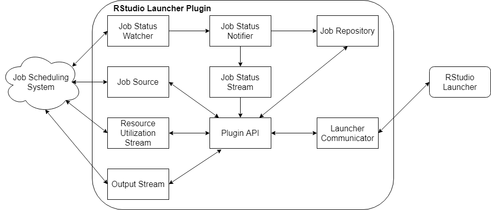

# RStudio Launcher Plugin SDK Architecture {#sdkarch}

The RStudio Launcher Plugin SDK is designed to allow the Plugin developer to implement as little code as possible in order to get a working Plugin. Figure \@ref(fig:sdk-arch) describes the architecture of the SDK at a high, component level. The Plugin developer only needs to be concerned with those components which interface directly with the job scheduling system: Job Status Watcher, Job Source, Resource Utilization Stream, and Output Stream. Nevertheless, it can be useful to have a more full understanding of the workings of the SDK when making complex implementation decisions.

```{r sdk-arch, echo=FALSE, eval=TRUE, fig.cap="High Level Architecture"}

```


## Launcher Communicator Component {#comms-component}

The Launcher Communicator component is responsible for receiving and interpreting requests from the Launcher, and translating and sending responses to the Launcher. 

The Launcher Communicator listens for data on a background thread. When data is received, the Launcher Communicator component parses and validates the data and converts each request it finds into the appropriate Request object. As parsing a request is an expensive operation, the Launcher Communicator also performs this task on a background thread. The Request object is then passed to the Plugin API component to be fulfilled.

When the Plugin API has the response to a request, it posts the Response object to the Launcher Communicator. The Launcher Communicator then formats the response in a way the Launcher will understand and sends it to the Launcher on a background thread.

This component is fully implemented by the SDK, and requires no action from the Plugin developer.

## Components {#components}

### Plugin API Component {#api-component}

Where the Launcher Communicator is responsible for translating the requests from the Launcher, the Plugin API component is responsible for understanding the meaning of them. Given a particular request, the Plugin API's responsibility is to dispatch the correct action from the Job Source and then convert the output to the appropriate Response object. 

[Chapter 5](#pluginapi) will discuss each API call and how the Plugin API component translates those requests into actionable items for the Job Source or other components.

<!-- TODO: It's possible some thread safety may be handled by the SDK base classes. This should be updated based on specifics when they're available.  -->
Each Request that is received is processed on its own thread. As a result, classes which are implemented by the Plugin developer need to be thread safe. If the limit of threads for the process is reached, Requests will be queued until a thread is available.

### Job Source Component {#source-component}

The Job Source component is the main point of contact between the job scheduling system and the Plugin. The majority of the implementation work for the Plugin developer will be within this component. There are a few Launcher requests which require streamed responses. These streamed responses are the only ones which aren't covered by the Job Source. 

In the majority of cases, when the Plugin API receives a request from the Launcher, it will invoke one or more methods on the Job Source and then compose a response for the Launcher based on the returned data. 

On Plugin startup, 

There is only one instance of the Job Source per instance of the Plugin. Because the Launcher can make multiple requests to a single Plugin without receiving their responses, it is possible that the Plugin API will invoke the same method on the Job Source for the same resource concurrently. In that case, the Job Source may perform the requests sequentially, if necessary. There is no requirement that Launcher requests are responded to in any particular order. For the sake of performance, however, it is ideal to perform any tasks concurrently which may be safely performed concurrently.

### Job Repository Component {#job-repo}

The Job Repository component maintains a store of jobs. Jobs which have been finished for a configurable period of time will be purged from the system. The Job Repository is mainly managed by SDK implemented classes. To ensure proper job status records, the Plugin developer only needs to be concerned with implementing a Job Status Watcher. 

The Job Status Watcher is responsible for interfacing with the job scheduling system to keep track of job status changes. For the convenience of the Plugin developer, there are two base classes for the Job Status Watcher which may be inherited from: `AbstractJobStatusWatcher` and `AbstractTimedJobStatusWatcher`. 

The `AbstractTimedJobStatusWatcher` has a pure virtual method which is responsible for getting the statuses of all the jobs each time it is invoked. On a configurable timer, the `AbstractTimedJobStatusWatcher` will invoke said method, and then use the results to update the Job Status Notifier component, which will in turn update any components which are interested in hearing about job status changes, such as all open Job Status Streams.

On the other hand, the `AbstractJobStatusWatcher` has a pure virtual method which is responsible for streaming job statuses until the stream is canceled. The Plugin developer may choose to use either base class, depending on whether the job scheduling system has a way to stream job statuses or not.

## Plugin Startup {#startup}


## Plugin Teardown {#teardown}


