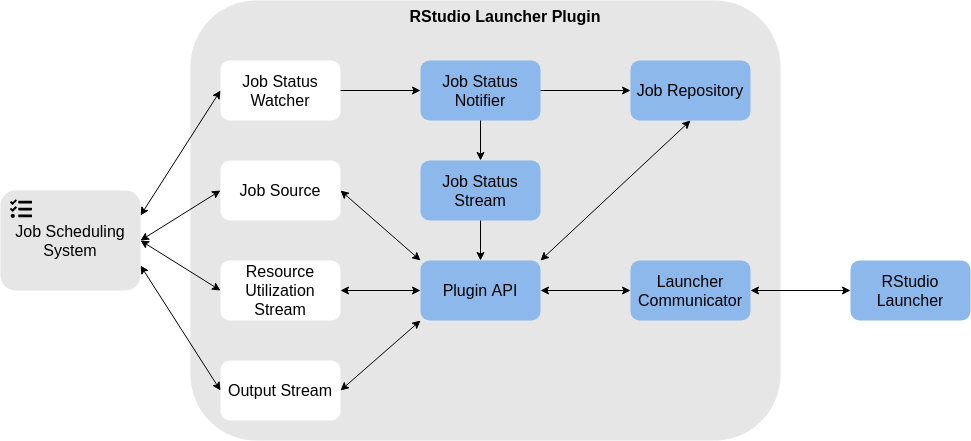

# RStudio Launcher Plugin SDK Architecture {#sdkarch}

The RStudio Launcher Plugin SDK is designed to allow the Plugin developer to implement as little code as possible in order to get a working Plugin. Figure \@ref(fig:sdk-arch) describes the architecture of the SDK at a high, component level. The Plugin developer only needs to be concerned with those components which interface directly with the job scheduling system: Job Status Watcher, Job Source, Resource Utilization Stream, and Output Stream. Nevertheless, it can be useful to have a more full understanding of the workings of the SDK when making complex implementation decisions.

```{r sdk-arch, echo=FALSE, eval=TRUE, fig.cap="High Level Architecture"}

```


## Launcher Communicator

The Launcher Communicator component is responsible for receiving and interpreting requests from the Launcher, and translating and sending responses to the Launcher. 

The Launcher Communicator listens for data on a background thread. When data is received, the Launcher Communicator component parses and validates the data and converts each request it finds into the appropriate Request object. As parsing a request is an expensive operation, the Launcher Communicator also performs this task on a background thread. The Request object is then passed to the Plugin API component to be fulfilled.

When the Plugin API has the response to a request, it posts the Response object to the Launcher Communicator. The Launcher Communicator then formats the response in a way the Launcher will understand and sends it to the Launcher on a background thread.

This component is fully implemented by the SDK, and requires no action from the Plugin developer.

## Plugin API

