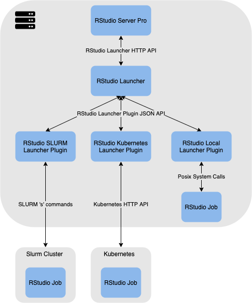

# Introduction {#intro}
The purpose of the RStudio Launcher is to provide a generic interface between the RStudio IDE and an arbitrary job scheduling system. Each RStudio Launcher Plugin will allow the RStudio IDE to launch jobs, such as R Sessions, R scripts, and Jupyter Notebooks, to a job scheduling system without requiring any modification to the RStudio IDE itself.

The goal of an RStudio Launcher Plugin is to implement each RStudio Launcher API in a way that the intended action of the API will be completed by the job scheduling system with which it interfaces. Some features of the job scheduling system may not be exposed, and some limitations of the job scheduling system may need to be worked around.

Figure \@ref(fig:rl-arch) depicts the architecture of the RStudio Launcher, using three existing RStudio Launcher Plugins as examples. The following communication will occur if a user creates a new R session in the Kubernetes cluster:

1. RStudio Server Pro will build the command and arguments to run the R Session.
2. RStudio Server Pro will send a job submission request to the RStudio Launcher over HTTP, including the R Session command, arguments, the user-requested cluster, and any resource constraints set by the user.
3. The RStudio Launcher will verify that a cluster matching the requested Kubernetes cluster exists.
4. Upon finding a valid Kubernetes cluster, the RStudio Launcher will forward the request to the RStudio Kubernetes Launcher Plugin via the JSON RStudio Launcher Plugin API.
5. The Kubernetes Plugin will create a pod with the requested resource restrictions and launch the R Session with the specified command and arguments, via the Kubernetes HTTP API.
6. The Kubernetes Plugin will report either success or failure to the RStudio Launcher via the JSON RStudio Launcher Plugin API, based on the response from the Kubernetes HTTP API.
7. The RStudio Launcher will forward the result to RStudio Server Pro via the RStudio Launcher HTTP API.

```{r rl-arch, echo=FALSE, fig.cap="RStudio Launcher Archeticture", fig.align="center"}

```

Many of the steps listed above are the same regardless of the job scheduling system in use. The RStudio Launcher Plugin SDK aims to reduce the development time and maintenance cost of RStudio Launcher Plugins by implementing common functionality and providing a straightforward framework for implementing the job scheduling system specific components of the RStudio Launcher Plugin.